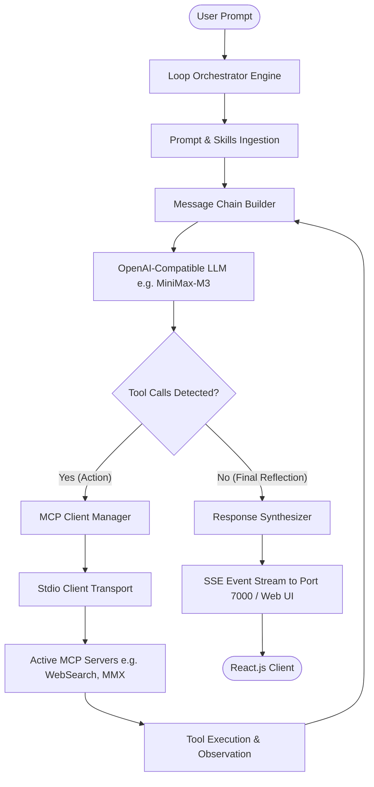

# MiniBot Architecture & Protocol Specification

The **MiniBot** is an autonomous iterative execution system designed to augment Large Language Models (LLMs) that natively lack direct external capabilities—such as real-time web search, multimodal asset generation, or local code execution. Powered by a ReAct loop engineering protocol and the Model Context Protocol (MCP), MiniBot runs as both a web application and a native desktop app via Tauri v2.

Rather than relying on closed, proprietary tool platforms, this system implements an open standard host based on the **Model Context Protocol (MCP)** and an **OpenAI-compatible Tool Calling loop**.

---

## 2. Loop Engineering Mechanism & Logic Index

To facilitate end-to-end investigation of the autonomous loop, this section groups and indexes the core mechanisms, design patterns, and corresponding technical documentation:

| Domain / Sub-System | Engineering Mechanism & Logic | Implementation & Deep-Dive References |
|---|---|---|
| **Core State Machine & Lifecycle** | • ReAct Iteration Loop (`Step Start` $\rightarrow$ `LLM Reasoning` $\rightarrow$ `Tool Dispatch` $\rightarrow$ `Observation Feedback` $\rightarrow$ `Synthesis`) • Terminal evaluation condition (text vs. tool_calls) • Message chain assembly with System, Skills & Attached Context | • [`src/engine/loop-orchestrator.ts`](file:///c:/ai/loop-engg/src/engine/loop-orchestrator.ts) • [01. Architecture & Protocol Specification](./01-architecture-and-protocol.md) • [06. Technology Stack Specification](./06-technology-stack.md) |
| **Safety Guardrails & Halting Conditions** | • Bounded iteration limits (`maxLoopIterations: 25`) • Infinite tool loop circuit breaker & repetitiveness detection • Fallback snippet preservation on guardrail trigger • IPC timeout & Stdio buffering deadlocks mitigation | • [`src/engine/loop-orchestrator.ts#L188-L204`](file:///c:/ai/loop-engg/src/engine/loop-orchestrator.ts#L188-L204) • [03. Technical Challenges & Solutions](./03-technical-challenges-and-solutions.md) |
| **Dynamic MCP & Meta-Tooling** | • Per-iteration dynamic tool discovery (`getOpenAITools()` called in every loop step) • Autonomous self-equipping meta-tools (`search_available_tools`, `install_mcp_package`) • Zero-downtime hot-reloading mid-loop | • [`src/mcp/client-manager.ts`](file:///c:/ai/loop-engg/src/mcp/client-manager.ts) • [02. MCP Integration Guide](./02-mcp-integration-guide.md) • [19. Autonomous Self-Equipping Tools Architecture](./19-autonomous-self-equipping-tools-and-dynamic-mcp-architecture.md) |
| **Context Governance & Memory** | • Observation Bloat suppression & payload truncations • Multi-turn state preservation and Sliding Window Context • Zero-database folder-based workspace & conversation isolation | • [07. Conversation Memory & State Continuity](./07-conversation-memory-and-state.md) • [12. Workspace & Conversation Tree Architecture](./12-workspace-and-conversation-tree-architecture.md) |
| **Autonomous Self-Correction** | • Tool execution error capture (`[Tool Execution Error]`) fed into LLM Observation • In-loop query reformulation, parameter retries & fallback MCP servers | • [`src/engine/loop-orchestrator.ts#L160-L173`](file:///c:/ai/loop-engg/src/engine/loop-orchestrator.ts#L160-L173) • [05. Agentic Looping & Self-Correction Case Study](./discussion.md) |
| **Real-Time Streaming & Client Ergonomics** | • SSE streaming contracts (`step_start`, `tool_call`, `tool_result`, `turn_complete`) • Real-time token badges, active model state, and UI feedback synchronization | • [`src/server.ts`](file:///c:/ai/loop-engg/src/server.ts) • [08. UI/UX & Session Management Specification](./08-ui-ux-and-session-management.md) • [18. Server-Side LLM Proxy Architecture](./18-server-side-llm-proxy-and-cors-architecture.md) |

---

## 3. Core Architectural Components

### 3.1 Prompt & AI Skill Ingestion Layer
Located at `src/config/schema.ts` and `src/config/index.ts`.
- **System Prompt**: Defines fundamental operational boundaries, role identity, and reasoning standards.
- **Skills Prompt**: Hot-pluggable instruction blocks declaring active tools, procedural workflows, and error recovery policies.
- **Dynamic Skill Resolver (`globalSkillManager`)**: Dynamically resolves and injects workspace-scoped and global AI skills based on prompt intent.
- **Context Injection**: Prepend ground truth documents under `[ATTACHED KNOWLEDGE BASE]` and SVG theme palettes before execution.

### 3.2 Model Context Protocol (MCP) Host Layer
Located at `src/mcp/client-manager.ts`.
- **Host Client**: Built on `@modelcontextprotocol/sdk`.
- **Discovery Mechanism**: Queries connected servers on startup (`listTools`) to inspect names, descriptions, and JSON Schemas (`inputSchema`).
- **Dynamic Tool Resolution**: Refreshes tool definitions on every iteration step so dynamically loaded tools are immediately visible to the LLM.
- **Translation Engine**: Translates MCP `Tool` definitions directly into OpenAI `ChatCompletionTool` format.
- **Execution Router**: Dispatches tool calls by matching tool names to corresponding `StdioClientTransport` or `StreamableHttpClientTransport` instances with workspace isolation.

### 3.3 ReAct Loop Engine (`LoopOrchestrator`)
Located at `src/engine/loop-orchestrator.ts`.
Implements an autonomous state machine with the following lifecycle:
1. **Step Start (`onStepStart`)**: Increments iteration counter, checks iteration limits against `maxIterations`.
2. **Dynamic Tool Refresh**: Ingests fresh tools from `MCPClientManager.getOpenAITools()` to support hot-loaded tools.
3. **LLM Inference**: Dispatches current message history and tools to the LLM Client.
4. **Action Branching**:
   - **Case A: Tool Calls Present**:
     - Emits `onToolCall` with parsed parameters.
     - Executes target tool via `MCPClientManager.executeTool()`.
     - Catches execution errors gracefully as `[Tool Execution Error]: ...` observations.
     - Appends observation message (`role: "tool"`, matching `tool_call_id`).
     - Re-enters loop to allow LLM reflection.
   - **Case B: No Tool Calls (Terminal State)**:
     - Extracts synthesized plain text / markdown / SVG response.
     - Emits `onComplete` and returns final payload.
5. **Guardrail Circuit Breaker**:
   - If iteration counter reaches `maxIterations`, terminates gracefully.
   - Extracts the last assistant thought or last tool observation preview to prevent context loss.

---

## 4. Communication & Streaming Protocol (SSE)
Located at `src/server.ts`.
Events are streamed in real time over HTTP using Server-Sent Events (`POST /api/chat`):

| Event Name | Payload | Description |
|---|---|---|
| `step_start` | `{"iteration": 1}` | Fired when a new loop iteration commences. |
| `skill_activated` | `{"skills": ["..."]}` | Emitted when dynamic AI skills are activated for the prompt. |
| `tool_call` | `{"toolName": "...", "args": {...}, "serverName": "...", "timestamp": ...}` | Emitted when LLM requests an MCP action. |
| `tool_result` | `{"toolName": "...", "result": "...", "serverName": "...", "timestamp": ...}` | Emitted when MCP server returns tool results. |
| `complete` | `{"answer": "...", "iterations": 5, "activeSkills": [...]}` | Emitted when LLM produces the final synthesized response. |
| `error` | `{"message": "..."}` | Emitted if an unrecoverable failure occurs in the loop. |

