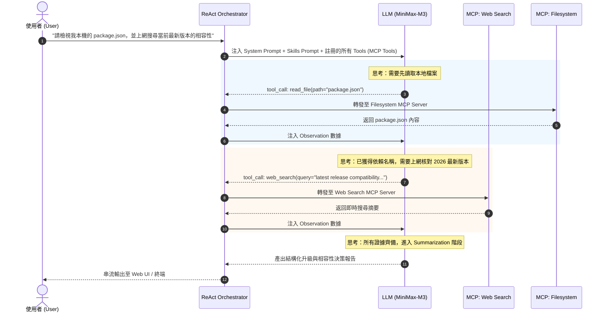

# Chapter 09: Multi-MCP Extensibility & Skills Prompt Design Patterns
## 多類型 MCP 擴展架構與 Skills Prompt 契約設計規範

在構建企業級自主代理（Autonomous Agent）時，單一領域的工具（如僅具備網絡搜尋）遠遠不足以應對複雜的工程與業務需求。本篇文檔深入探討在 **Mini Chat Bot（Loop Engineering 架構）** 中，**如何接入不同類型的 MCP（Model Context Protocol）伺服器**，並剖析 **Skills & Protocols System Prompt** 為何是驅動 ReAct 思考循環的「神經中樞與行為憲法」。

---

## 一、為什麼 Skills & Protocols Prompt 至關重要？

在 `loop.config.json` 或 `src/config/schema.ts` 中，我們定義了核心技能規範：

```markdown
## AI Skills & Protocols:
- Web Search & Retrieval: When looking up current events, documentation, or technical information, use the `web_search` or `fetch_page` MCP tools.
- Iterative Loop: Do not guess or hallucinate. Use tool calls to verify facts.
- Summarization: Synthesize findings cleanly with markdown formatting.
```

這段指令絕非普通提示詞，而是約束模型認知行為的 **三柱神（Three Pillars of Agent Cognition）**：

```
                    ┌─────────────────────────────────────────┐
                    │      Skills & Protocols Prompt 契約     │
                    └────────────────────┬────────────────────┘
                                         │
        ┌────────────────────────────────┼────────────────────────────────┐
        ▼                                ▼                                ▼
┌──────────────────────┐   ┌──────────────────────────┐   ┌──────────────────────────┐
│  1. 意圖與工具映射   │   │  2. 自我修復與循環推動力 │   │   3. 結構化綜合合約      │
│  (Intent-to-Tool)    │   │  (Anti-Hallucination &   │   │   (Synthesized Output)   │
│                      │   │   Self-Correction Loop)  │   │                          │
│ 清楚定義何時調用特定 │   │ 嚴禁臆測。搜尋失敗時激發 │   │ 消化海量 Raw Observation │
│ MCP 工具，消除猜測。 │   │ 第二輪、第三輪自我修正。 │   │ 整理成高價值決策報告。   │
└──────────────────────┘   └──────────────────────────┘   └──────────────────────────┘
```

### 1. 意圖對齊（Intent-to-Tool Mapping）
大模型的內部知識庫存在固定截止期（Knowledge Cutoff）。若無顯式指示，當使用者詢問時事或最新技術時，LLM 傾向直接說「我沒有即時資訊」或自言自語。該條款將使用者的**情境特徵**（時事、技術文檔）直接綁定到具體工具名稱（`web_search`、`fetch_page`），建立明確的調用路徑。

### 2. 反思與推動 ReAct 循環（Iterative Loop & Self-Correction）⭐ *最關鍵核心*
* **壓制幻覺（Hallucination Suppression）**：強行打斷 LLM「不懂裝懂」的生成傾向。
* **激發跨輪重試**：當第 1 輪工具調用返回異常（如網絡超時、404、或檢索不到關鍵詞）時，正因有「*Do not guess or hallucinate. Use tool calls to verify facts.*」，模型不會草率終止，而是會自動發起第 2 步、第 3 步，改換關鍵字或改用替代工具，直到取得確鑿證據！

### 3. 結構化輸出合約（Summarization & Synthesis）
工具返回的原始資料（Raw Observation）動輒數萬字元，充斥各類標籤與雜訊。此合約強制模型在終止循環時，必須將零碎證據提煉為清晰的 Markdown 報告與決策矩陣。

---

## 二、多類型 MCP（Model Context Protocol）擴展矩陣

當系統從單一的搜尋能力擴展為全功能代理時，可橫向接入不同類型的 MCP Server。下表列出五大主流 MCP 類別、代表工具、配置方式及對應的 Prompt 擴展範例：

| MCP 類型 | 典型 Tool 名稱 | 應用場景 | 推薦 Skills Prompt 擴展範例 |
|---|---|---|---|
| **1. 檔案系統 (Filesystem)** | `read_file`, `write_file`, `list_directory` | 代碼審查、專案文檔檢視、本地數據讀取 | `- Local Filesystem: Use read_file or list_directory to inspect workspace code and docs before giving advice. Always verify paths exist.` |
| **2. 資料庫檢索 (Database)** | `query_database`, `describe_table`, `list_tables` | 內部運維指標查詢、業務報表生成 | `- Database Inspection: Inspect schema with describe_table before executing read-only SQL via query_database. Never run destructive mutations (DROP, DELETE).` |
| **3. Git / 倉庫 (GitHub)** | `get_issue`, `search_repos`, `read_code` | 開源項目追蹤、Bug 單排查、PR 審查 | `- GitHub Integration: Fetch commit logs and issues via GitHub MCP tools instead of guessing repository history.` |
| **4. 系統指令 (Terminal / CLI)** | `execute_command`, `run_terminal` | 自動化構建、單元測試、網絡診斷 | `- Command Execution: Execute terminal commands to verify builds or tests. Inspect stdout and stderr to diagnose failures.` |
| **5. 多模態生成 (Multimodal)** | `generate_image`, `synthesize_speech` | 視覺架構圖生成、語音旁白合成 | `- Multimodal Generation: Invoke multimodal tools when the user requests generating images, voiceovers, or background music.` |

---

## 三、多 MCP 整合架構與配置實踐

在 `loop-engg` 專案中，MCP 的註冊是**完全模組化與宣告式（Declarative）**的。所有 MCP Server 均於 `loop.config.json` 的 `mcpServers` 區塊宣告：

### 1. 多 MCP 伺服器宣告範例 (`loop.config.json`)

```json
{
  "llm": {
    "baseUrl": "https://api.minimaxi.com/v1",
    "apiKey": "${LLM_API_KEY}",
    "model": "MiniMax-M3",
    "temperature": 0.7,
    "maxTokens": 4096
  },
  "prompts": {
    "systemPrompt": "You are an expert Mini Chat Bot Assistant. You have access to external tools via the Model Context Protocol (MCP). When the user asks a question that requires real-time facts, workspace files, or multi-step execution, inspect available tools, call them, analyze the result, and iteratively determine if additional steps are required before delivering your final answer.",
    "skillsPrompt": "## AI Skills & Protocols:\n- Web Search & Retrieval: Use `web_search` or `fetch_page` when looking up external facts, modern libraries, or current events.\n- Workspace Filesystem: When asked about local projects, inspect project files via `read_file` or `list_directory`.\n- Iterative Loop: Do not guess or hallucinate. Cross-verify tool observations across multiple iterations.\n- Safety Guardrails: Never perform destructive file or database writes unless explicitly confirmed.\n- Summarization: Synthesize all findings cleanly with markdown formatting, tables, and step-by-step guidance."
  },
  "mcpServers": {
    "web-search": {
      "command": "node",
      "args": ["dist/mcp/servers/web-search-server.js"],
      "enabled": true,
      "description": "Provides internet web search and page content fetching capabilities"
    },
    "filesystem": {
      "command": "npx",
      "args": ["-y", "@modelcontextprotocol/server-filesystem", "C:\\ai\\loop-engg"],
      "enabled": true,
      "description": "Provides secure workspace directory and file inspection"
    },
    "minimax-multimodal": {
      "command": "node",
      "args": ["dist/mcp/servers/minimax-server.js"],
      "enabled": true,
      "description": "Provides MiniMax multimodal tools (search, image, voice, music)"
    }
  },
  "maxLoopIterations": 10
}
```

### 2. 跨 MCP 認知調度流程（Cognitive Routing Flow）

當系統同時掛載多個 MCP 時，ReAct Orchestrator 扮演動態路由器角色：



---

## 四、Prompt 升級設計模式（Upgraded Prompt Templates）

當引入新的 MCP（如 Filesystem 或 Database）時，Prompt 的升級需涵蓋 **身份認知（System Prompt）** 與 **行為準則（Skills Prompt）** 兩個層次：

### 1. 宏觀身份認知：`systemPrompt` 升級範例
在 System Prompt 中明確追加擴展能力維度，建立全局意圖認知：
```text
You are an expert Mini Chat Bot Assistant. You have access to external tools via the Model Context Protocol (MCP), including real-time web search, multimodal services, and local filesystem inspection. When the user asks a question requiring external facts, workspace analysis, or file examination, inspect available tools, call them, analyze the result, and iteratively determine the next steps until delivering a comprehensive, evidence-based answer.
```

### 2. 微觀行為契約：`skillsPrompt` 升級範例
在 Skills Prompt 中精確指定工具觸發條件與防禦規則：
```markdown
## AI Skills & Protocols:
- Web Search & Retrieval: When looking up current events, documentation, or technical information, use the `web_search` or `fetch_page` MCP tools.
- Local Filesystem Inspection: When the user asks to review code, check configuration files, or inspect workspace documents, use `read_file` or `list_directory`. Always read the actual file content before offering architectural recommendations or refactoring advice.
- Safety Guardrails: Prioritize read-only inspection. Never perform destructive write or delete actions unless explicitly confirmed by the user.
- Iterative Loop: Do not guess or hallucinate. Cross-verify tool observations across multiple iterations.
- Summarization: Synthesize findings cleanly with markdown formatting, code snippets, and decision tables.
```

### 3. 在 `loop.config.json` 中的完整 JSON 配置
```json
{
  "prompts": {
    "systemPrompt": "You are an expert Mini Chat Bot Assistant. You have access to external tools via the Model Context Protocol (MCP), including real-time web search, multimodal services, and local filesystem inspection. When the user asks a question requiring external facts, workspace analysis, or file examination, inspect available tools, call them, analyze the result, and iteratively determine the next steps until delivering a comprehensive, evidence-based answer.",
    "skillsPrompt": "## AI Skills & Protocols:\n- Web Search & Retrieval: When looking up current events, documentation, or technical information, use the `web_search` or `fetch_page` MCP tools.\n- Local Filesystem Inspection: When the user asks to review code, check configuration files, or inspect workspace documents, use `read_file` or `list_directory`. Always read the actual file content before offering architectural recommendations or refactoring advice.\n- Safety Guardrails: Prioritize read-only inspection. Never perform destructive write or delete actions unless explicitly confirmed by the user.\n- Iterative Loop: Do not guess or hallucinate. Cross-verify tool observations across multiple iterations.\n- Summarization: Synthesize findings cleanly with markdown formatting, code snippets, and decision tables."
  }
}
```

---

## 五、Prompt 設計最佳實踐與工程價值

1. **工具名稱嚴格一致（Exact Tool Identifier Matching）**：
   Prompt 中提及的 Tool 名稱（例如 `` `read_file` ``、`` `web_search` ``）必須與 MCP Server 在 `tools/list` 協定中回傳的名稱 100% 吻合，以確保 LLM 生成工具呼叫時的信心值達到最高。
2. **防禦性約束（Safety Guardrails & Sandboxing）**：
   對於具有副作用的 MCP（如寫入檔案、執行 Shell、修改資料庫），必須在 Prompt 中加入「唯讀優先（Read-only First）」或「操作前必須先取得用戶明確指示」等負面約束，防止大模型誤操作或覆蓋重要本機檔案。
3. **分階段思考引導（Chain-of-Thought Guidance）**：
   若任務跨越不同 MCP，在 Prompt 中引導模型遵循「先檢視、再搜尋、最後統整」的邏輯順序，避免模型在同一輪並行發出互相衝突的工具調用。
4. **杜絕空憑臆測（Grounding in Actual Code）**：
   「*Always read the actual file content before offering architectural recommendations*」能徹底根除 LLM「憑記憶胡謅代碼」的毛病，強制其先透過 MCP 工具獲取專案真實情況。


---

## 4. MCP & Skills Lifecycle: Active vs Disabled Isolation

MiniBot maintains a strict segregation between active operational extensions and deactivated items across both MCP and Skills:

### 1. Metric Hierarchy
1. **Total Active MCP**: All mounted MCP servers across current workspace scope and inherited global/user scopes that have `enabled !== false` (e.g., `web-search`, `minimax-multimodal`, `bigfix`).
2. **Total Disabled MCP**: Registered MCP server definitions explicitly configured with `enabled: false` (e.g., `mini-news` to prevent unintended subprocess spawning or port binding).
3. **Total Active Skills**: Discovered skills from global (`.minibot/skills`, `.agents/skills`) and workspace (`logs/.skills`) directories with valid `SKILL.md` contracts.
4. **Total Disabled Skills**: Skills explicitly placed in inactive storage or flagged as inactive.

### 2. UI Separation Rules
- In **ToolHubModal**, Active and Disabled servers/skills must NOT be mixed in a single flattened list.
- Disabled items are segregated into a dedicated inactive view/accordion with clear status badges, allowing one-click reactivation without polluting active LLM prompt contexts.
