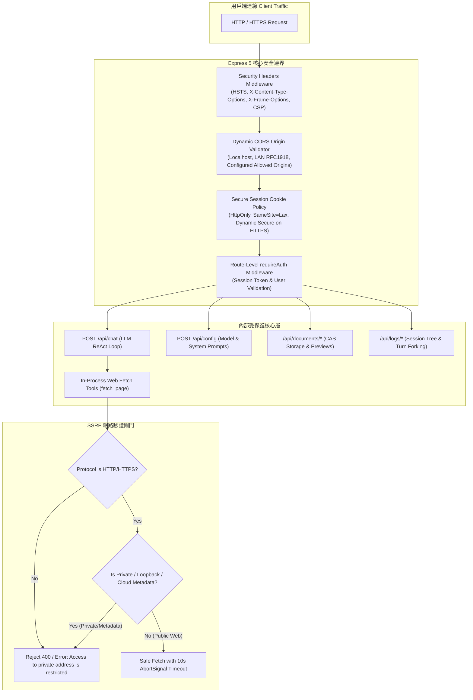

# 16. Security Hardening, SSRF Defense, HSTS & API Authorization Architecture

本文件詳細記錄 **MiniBot** 於安全防護（Security Hardening）、主機伺服器端請求偽造防禦（SSRF Defense）、HSTS 安全標頭機制、跨來源策略（CORS）以及敏感 API 存取控制（Authentication & Authorization）的設計規範與技術實作。

---

## 1. 架構全景 (Security Architecture Overview)



---

## 2. HTTP 安全標頭與 HSTS 機制 (Security Headers & HSTS)

位於 [`src/server.ts`](file:///c:/ai/loop-engg/src/server.ts)，全系統掛載嚴格的安全性標頭中介軟體：

### 2.1 HSTS (Strict-Transport-Security)
- **條件式注入**：當連線為 HTTPS（或經由反向代理轉發 `x-forwarded-proto: https`）時自動注入：
  ```http
  Strict-Transport-Security: max-age=31536000; includeSubDomains; preload
  ```
- **設計決策**：在開發本機純 HTTP 模式下不強制注入，避免造成本機自簽名證書開發阻礙；在正式生產環境 HTTPS 網域下強制全域啟用一年期 HSTS，預防 SSL 剝離攻擊（SSL Stripping）。

### 2.2 防點擊劫持與 MIME 混淆 (Anti-Clickjacking & MIME-Sniffing)
- `X-Content-Type-Options: nosniff`：徹底阻斷瀏覽器對內容類型的嗅探行為，防禦基於非執行副檔名嵌入惡意程式碼。
- `X-Frame-Options: SAMEORIGIN`：嚴禁任何第三方外部網域透過 `<iframe>` 嵌入 MiniBot 介面，防範 UI 覆蓋與點擊劫持（Clickjacking）。
- `X-XSS-Protection: 1; mode=block`：在舊型瀏覽器中強制啟用反射型 XSS 阻斷過濾器。
- `Referrer-Policy: strict-origin-when-cross-origin`：在跨來源跳轉時僅發送來源網址（Origin），隱藏對話與查詢字串等機敏路徑。
- `Permissions-Policy: camera=(), microphone=(self), geolocation=()`：精確授予麥克風本機語音辨識權限，全面停用攝影機與地理定位等未授權周邊。

---

## 3. 動態 CORS 來源驗證與 Cookie 安全策略

### 3.1 嚴格限制跨來源資源共享 (Tightened CORS)
過往採用 `cors({ origin: true })` 會無差別信任任意 Web 頁面發起的跨來源憑證請求。新架構採用動態白名單校驗函式：
- 允許本機迴路存取（`localhost`、`127.0.0.1`、`[::1]`）。
- 允許企業私有內網網段（RFC 1918：`192.168.x.x`、`10.x.x.x`、`172.16-31.x.x`）與區域網 `.local`。
- 支援環境變數 `ALLOWED_ORIGINS` 配置自訂安全網域名單（以逗號分隔）。
- 任何未經授權的第三方公網網域嘗試呼叫 API 時，CORS 自動予以攔截。

### 3.2 動態 Secure 標籤 Session Cookies
在使用者登入（`POST /api/auth/login`）發放 `loop_session` Cookie 時：
- `httpOnly: true`：禁止任何前端 JavaScript 存取 Cookie，防範 XSS 竊取憑證。
- `sameSite: "lax"`：平衡跨站請求偽造（CSRF）保護與一般連結跳轉體驗。
- `secure: isSecureConnection(req)`：動態偵測當前傳輸協定。在 HTTPS 或經由 `X-Forwarded-Proto: https` 終止 TLS 時，自動附加 `; Secure` 標籤，保證憑證絕不透過明文 HTTP 外洩。

---

## 4. SSRF (伺服器端請求偽造) 深度防禦

在內建工具庫 [`src/mcp/inprocess-tools.ts`](file:///c:/ai/loop-engg/src/mcp/inprocess-tools.ts) 中，`fetch_page` 工具為 AI 提供抓取網頁內容的能力。為防止提示詞注入（Prompt Injection）攻擊誘導 AI 刺探本機連接埠（例如 8045 LLM 代理）或雲端環境憑證中繼資料，系統實作了嚴密的主機驗證機制：

```typescript
function isPrivateOrReservedHost(hostname: string): boolean {
  const lower = hostname.toLowerCase();
  // 1. 本地迴路與特殊主機名
  if (lower === "localhost" || lower === "127.0.0.1" || lower === "::1" || lower === "0.0.0.0") {
    return true;
  }
  // 2. 雲端執行個體中繼資料服務 (AWS, Azure, GCP Instance Metadata)
  if (lower === "169.254.169.254" || lower === "metadata.google.internal") {
    return true;
  }
  // 3. RFC 1918 私有網段與內部子網驗證
  if (lower.startsWith("10.") || lower.startsWith("192.168.") || lower.startsWith("127.")) {
    return true;
  }
  // 172.16.0.0/12 網段檢驗
  const match172 = lower.match(/^172\.(\d+)\./);
  if (match172) {
    const secondOctet = parseInt(match172[1], 10);
    if (secondOctet >= 16 && secondOctet <= 31) return true;
  }
  return false;
}
```

- **協定限制**：僅允許 `http:` 與 `https:` 協定，全面封鎖 `file://`、`gopher://` 等危險協定。
- **請求逾時**：強制掛載 `AbortSignal.timeout(10000)`，防止惡意連線掛起阻斷伺服器執行緒。

---

## 5. 敏感 API 端點全面認證防護 (Authentication Enforcement)

在全站 API 路由中，除登入認證端點（`/api/auth/login`, `/api/auth/me`）與首頁前端靜態頁面外，以下關鍵路由全數掛載 `requireAuth` 中介軟體防護：

| 受保護路由 | HTTP 動詞 | 安全風險與防護目的 |
| :--- | :--- | :--- |
| `/api/chat` | `POST` | 防範未授權第三方呼叫昂貴的後端 LLM 推理循環與 MCP 工具鏈。 |
| `/api/config` | `POST` | 防止未授權變更 LLM 模型、Base URL、系統提示詞或 MCP 註冊表。 |
| `/api/documents/*` | 全部 | 防止未授權讀取、下載或上傳企業內部 CAS 敏感文件。 |
| `/api/workspaces/*` | 全部 | 防止未授權列出、建立、重新命名或刪除企業對話工作區。 |
| `/api/logs/*` | 全部 | 防止未授權讀取歷史對話歷程或發起任意對話分支（Forking）。 |

任何未攜帶有效 `loop_session` 憑證的存取請求，一律直接返回 `HTTP 401 Unauthorized`，杜絕權限繞過。
