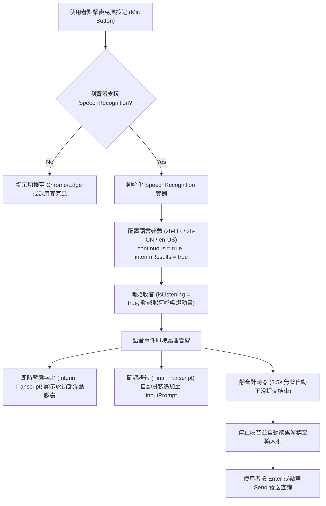

# 17. Voice Recognition (STT), Copy-Paste Ergonomics & Interactive UI Enhancement Architecture

本文件詳細記錄 **MiniBot** 在語音輸入（Speech-to-Text, STT）、多語言切換、剪貼簿人體工學（Copy-Paste Ergonomics）以及互動式 UI 元件增強的架構設計與實作規範。

---

## 1. 語音辨識 (Voice-to-Text / STT) 架構

前端整合了現代瀏覽器原生 Web Speech API (`webkitSpeechRecognition` / `SpeechRecognition`)，支援使用者以語音直接輸入提示詞，並即時轉換為文字傳送至輸入框。



### 1.1 多語言支援與語系持久化
在輸入列左側提供即時切換下拉選單，支援三大核心語系：
- **🇭🇰 粵語 (`zh-HK`)**：針對廣東話口語與香港用語最佳化，支援夾雜中英文詞彙辨識。
- **🇨🇳 國語 / 普通話 (`zh-CN`)**：標準普通話發音模型。
- **🇺🇸 英語 (`en-US`)**：全球通用英語辨識。

語系選擇自動持久化儲存於 `localStorage ("minibot_stt_lang")`，下次載入時自動套用使用者的偏好語系。

### 1.2 狀態提示與版面保護
- **頂部浮動懸浮膠囊 (Floating Status Pill)**：
  收音時於輸入框正上方以絕對定位彈出提示膠囊，顯示即時語音狀態與即時識別字串（Interim Result）。此設計避免了文字過長將底部輸入列向下推擠、遮擋聊天記錄的問題。
- **脈衝動態警示 (Pulsing Red Border)**：
  收音中麥克風按鈕與輸入框邊框呈現亮紅色柔和呼吸燈動畫（`voice-recording-pulse`），給予使用者明確的「正在收音」視覺指示。

---

## 2. 剪貼簿操作體驗 (Copy-Paste Ergonomics)

為提供流暢且直覺的文本交互體驗，MiniBot 於四個關鍵維度全面導入「一鍵複製 / 一鍵貼上」人體工學按鈕：

```
┌────────────────────────────────────────────────────────────────────────┐
│  ASSISTANT MESSAGE CARD                                                │
├────────────────────────────────────────────────────────────────────────┤
│  ┌─ 🧠 Thinking Process (420 chars) ──────────── [📋 Copy] [v] ──────┐  │
│  │  Reasoning analysis through web search results...                  │  │
│  └────────────────────────────────────────────────────────────────────┘  │
│                                                                        │
│  Here is the configuration:                                            │
│  ┌───────────────────────────────────────────────────────── [Copy] ──┐  │
│  │  server {                                                         │  │
│  │      listen 7009;                                                 │  │
│  │  }                                                                │  │
│  └───────────────────────────────────────────────────────────────────┘  │
│                                                                        │
│  Tokens: ~280 · Length: 980 chars · ⏱️ Time: 3.2s                       │
│  [📋 Copy Output]  [📥 Export HTML]                                    │
└────────────────────────────────────────────────────────────────────────┘

┌────────────────────────────────────────────────────────────────────────┐
│  [📎 Attachment] [🌿 Mermaid] [🇭🇰 粵語 v] [ Ask anything... [📋 Paste] ] [🎙️] [Send]
└────────────────────────────────────────────────────────────────────────┘
```

### 2.1 最終回覆一鍵複製 (`Copy Output`)
- **位置**：位於每筆 AI 回覆卡片底部的操作列（與 `Export HTML` 並列）。
- **文字過濾**：自動剔除內部 `<think>...</think>` 思考標籤，僅提取最終呈現給使用者的純淨回答內容。
- **視覺反饋**：點擊後圖標平滑切換為綠色勾選徽章（`ClipboardCheck`）與 `Copied!` 字樣，2 秒後自動復原。

### 2.2 程式碼區塊獨立複製按鈕 (`Code Block Copy`)
- **自動注入**：在 [`MarkdownRenderer.tsx`](file:///c:/ai/loop-engg/frontend/src/components/MarkdownRenderer.tsx) 中，透過 `useEffect` 自動檢測渲染出的所有 `<pre><code>` 節點，動態掛載右上角浮動複製按鈕（`.code-copy-btn`）。
- **懸浮反饋**：平常以 0.7 半透明低調呈現；滑鼠滑過時即時高亮（`opacity: 1`），點擊後以綠色勾選圖標提示成功。

### 2.3 思考歷程複製按鈕 (`Thinking Process Copy`)
- **位置**：位於 [`ThoughtBlock.tsx`](file:///c:/ai/loop-engg/frontend/src/components/ThoughtBlock.tsx) 思考歷程卡片的頂部右側標頭列。
- **用途**：允許開發者一鍵複製 AI 在中間思考步驟的完整推理鏈，便於除錯與 Prompt 優化。

### 2.4 輸入框快速貼上按鈕 (`Clipboard Paste`)
- **位置**：內嵌於底部主輸入框的右側內部。
- **體驗**：點擊呼叫 `navigator.clipboard.readText()`，將外部剪貼簿文字直接追加注入至當前輸入框，並自動將游標聚焦（Focus），大幅減少使用者的右鍵或鍵盤切換成本。
