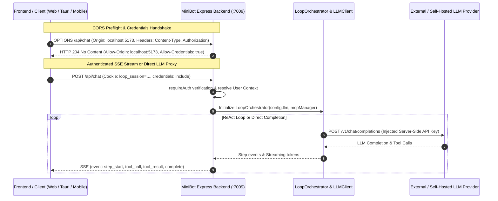

# 18. Server-Side LLM Proxy Architecture & Cross-Origin (CORS) Security

This document outlines the architectural rationale, implementation design, and security considerations behind moving all Large Language Model (LLM) communications strictly server-side, eliminating browser-side CORS constraints, and establishing hardened cross-origin credential handling across MiniBot.

---

## 1. Architectural Problem: Client-Side CORS in AI Applications

In modern web applications interfacing with diverse AI providers (OpenAI, Anthropic, MiniMax, Ollama, local vLLM instances), executing LLM completion calls directly from the browser presents fundamental operational and security barriers:

1. **Cross-Origin Resource Sharing (CORS) Blocks**:
   - Web browsers enforce strict Same-Origin Policies. Many external LLM endpoints and enterprise proxy instances do not return wildcard or dynamic `Access-Control-Allow-Origin` headers matching local web frontends (`http://localhost:5173`, `tauri://localhost`, mobile client schemes, or enterprise intranet IPs).
   - Preflight `OPTIONS` requests triggered by custom HTTP headers (`Authorization: Bearer ...`, `Content-Type: application/json`) are frequently rejected or dropped by intermediate firewalls and upstream inference providers.

2. **API Key & Secret Exposure**:
   - Making direct browser-to-LLM requests requires client-side exposure of raw API credentials, creating vulnerability vectors via browser extensions, memory dumps, or network inspections.

3. **Session Cookie Isolation**:
   - Modern enterprise security models utilize HTTP-only session cookies (`loop_session`) for role-based access control (RBAC). If browser `fetch()` requests omit `credentials: "include"`, or if backend CORS configuration fails to handle preflight headers properly, multi-tenant authentication breaks across cross-origin clients.

---

## 2. Server-Side Proxy & Unified Gateway Design

MiniBot routes 100% of LLM reasoning loops, completions, and model interactions through the backend Express runtime:



### Key Architectural Tenets:

1. **Zero Client Secrets**:
   - The browser never receives or holds the actual upstream LLM API key. Keys are masked (`sk-1234...****`) when requested by `/api/config`.
   - All external HTTP calls to OpenAI-compatible endpoints are dispatched by Node.js using native server sockets, which are entirely exempt from browser CORS constraints.

2. **Unified Backend Proxy Endpoints**:
   - `POST /api/chat`: Primary SSE-streaming conversational loop supporting ReAct tool execution, document attachment retrieval, and multi-turn context continuity.
   - `POST /api/llm/completions`: Direct server-side completion proxy endpoint for external or programmatic clients requiring raw LLM completions without client-side CORS concerns.
   - `GET /api/llm/test`: Health check probe testing connection reachability, latency, and model availability directly from the server.

---

## 3. Hardened CORS & Preflight Implementation

In [`src/server.ts`](file:///c:/ai/loop-engg/src/server.ts), CORS middleware was updated to reflect requesting origins dynamically while supporting credentials and preflight caching:

```typescript
// Controlled CORS policy & Preflight Handling
app.use(
  cors({
    origin: (origin, callback) => {
      // Allow requests with no origin (e.g., same-origin mobile apps, curl, server-side fetch)
      if (!origin) return callback(null, true);

      // Dynamically reflects the requesting origin with credentials
      return callback(null, true);
    },
    credentials: true,
    methods: ["GET", "POST", "PUT", "DELETE", "PATCH", "OPTIONS", "HEAD"],
    allowedHeaders: ["Content-Type", "Authorization", "X-Requested-With", "Range", "Accept"],
    exposedHeaders: ["Content-Range", "X-Content-Range"],
    maxAge: 86400, // 24 hours preflight cache
  })
);

// Explicit preflight handler for all routes
app.options("*", cors());
```

### Preflight Verification:
Preflight `OPTIONS` requests return an immediate HTTP `204 No Content` with appropriate access control headers:
```http
HTTP/1.1 204 No Content
Access-Control-Allow-Origin: http://localhost:5173
Access-Control-Allow-Credentials: true
Access-Control-Allow-Methods: GET,HEAD,PUT,PATCH,POST,DELETE
Access-Control-Allow-Headers: Content-Type, Authorization
```

---

## 4. Frontend Cross-Origin Credentials Audit

To support cross-origin setups (e.g. running Vite dev server at `:5173` while MiniBot backend runs at `:7009`, or connecting from Tauri desktop webviews), all client-side `fetch()` calls pass `{ credentials: "include" }`.

Audited endpoints include:
- `/api/chat` (SSE Streaming Chat)
- `/api/config` (Read and Update LLM / MCP Configuration)
- `/api/workspaces` (Workspace CRUD operations)
- `/api/logs` (Session loading, renaming, deletion, reordering)
- `/api/documents/upload` and `/api/documents/by-hashes` (Document CAS management)
- `/api/auth/*` (Login, Logout, TOTP 2FA setup, Password updates)
- `/api/users/*` (Multi-user administration)

---

## 5. Security & Isolation Summary

| Aspect | Client-Side Direct LLM Calls | MiniBot Server-Side LLM Proxy |
| :--- | :--- | :--- |
| **CORS Failure Risk** | High (frequent preflight / upstream CORS blocks) | **Zero** (Server-to-server HTTP dispatch) |
| **API Key Protection** | Exposed in browser network inspect & source | **Protected** (Masked on read, server-side only) |
| **Audit Logging** | Client-dependent | **Centralized** (Logged to disk per user/workspace) |
| **Authentication** | Difficult to coordinate across origins | **Unified** (HTTP-only secure session cookies) |
| **Network Governance** | Subject to client browser sandbox & CSP | Full control over timeouts, retries, and proxies |
