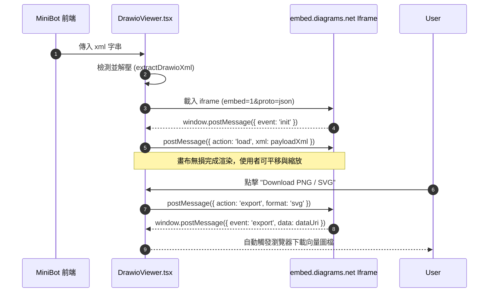

# Chapter 20: Visual Diagram Generation, Editorial SVG Default & Draw.io Architecture

## 一、概述與架構定位 (Overview & Architectural Positioning)

在企業級系統設計、雲原生架構規劃與複雜資料管道的討論中，文字與純 Markdown 表格無法完整呈現拓撲關係、服務分層（Tiers）、時序互動（Sequences）與正交連線（Orthogonal Connectors）。

MiniBot 打造了業界面向企業級架構師的 **三重視覺圖表渲染引擎（Triple Visual Diagram Engine）**，並確立了 **Editorial SVG 優先作為主預設架構（Zero-Sandbox Native Vector）**、**Draw.io 作為互動式可編輯架構（Interactive & Editable）** 的分層核心設計規範：

```
                                  ┌───────────────────────────────────────────────┐
                                  │      User Prompt / Architecture Request       │
                                  └──────────────────────┬────────────────────────┘
                                                         │
                                                         ▼
                                  ┌───────────────────────────────────────────────┐
                                  │       ReAct Loop & Prompt Protocol Core       │
                                  │  (Editorial SVG Default > Draw.io > Mermaid)  │
                                  └──────────────────────┬────────────────────────┘
                                                         │
                     ┌───────────────────────────────────┼───────────────────────────────────┐
                     ▼                                   ▼                                   ▼
      ┌─────────────────────────────┐     ┌─────────────────────────────┐     ┌─────────────────────────────┐
      │   1. Editorial SVG 向量圖   │     │    2. Draw.io 互動架構圖    │     │    3. Mermaid 流程/時序圖   │
      │    (Default & Recommended)  │     │   (Interactive & Editable)  │     │     (Code-Based Charts)     │
      ├─────────────────────────────┤     ├─────────────────────────────┤     ├─────────────────────────────┤
      │ • 原生 `<svg>` 渲染 DOM      │     │ • `<mxfile>` / `<diagram>`  │     │ • `flowchart`, `sequence`   │
      │ • 零 iframe 隔離、無跨域限制 │     │ • 雙向 postMessage 橋接     │     │ • 5 級色調主題 (Sky/Midnight)│
      │ • 100% 離線純向量 SVG 導出  │     │ • 離線/靜態 SVG 雙模轉換    │     │ • 節點字距行距自適應排版     │
      │ • 4 大主題即時變色 (Dark/..│     │ • 直連 diagrams.net 編輯    │     │ • 4:3 / 全景彈窗視角切換    │
      │ • 正交管線與動態高防重疊    │     │ • 支援存為 `.drawio` 原檔   │     │ • 防溢出與括號語法自動容錯  │
      └─────────────────────────────┘     └─────────────────────────────┘     └─────────────────────────────┘
```

---

## 二、Editorial SVG 預設架構設計 (Editorial SVG Primary Protocol)

### 1. 為什麼選擇 Editorial SVG 作為系統主要預設？
1. **零 Sandbox 隔離、100% 匯出可靠性**：
   - Draw.io 在瀏覽器嵌入官方 `embed.diagrams.net` 時，受限於第三方 iframe 的跨域沙盒（Cross-Origin Sandbox），無法直接透過父頁面 DOM 提取向量圖節點；若網路環境受限或 API 阻擋 `postMessage({ action: 'export' })`，導出 SVG 就會失敗。
   - **Editorial SVG 直接渲染於主頁面 DOM**（`SvgDiagramViewer.tsx`），不依賴任何外部伺服器或 iframe，可隨時在客戶端透過 `new XMLSerializer()` 導出 100% 純向量 SVG，無任何跨域或網路延遲風險。
2. **極致渲染效能與離線自主**：
   - 完全離線運行，在無外網內網封閉環境（Air-gapped Environments）中瞬間渲染完成，且原生支持滑鼠滾輪自由縮放（40% ~ 400%）、平移拖曳與 4 大主題即時變色。
3. **HTML 匯出原生保真**：
   - 匯出為 Standalone HTML 報告時，SVG 原始碼直接內嵌於 HTML 文件，無需動態下載外部 viewer JS 腳本即可在任何電腦、手機或紙本列印中以高解析度向量呈現。

### 2. Prompt 契約規範 (`src/config/schema.ts`)
系統在 `PromptsConfigSchema` 的 `skillsPrompt` 與 `svgPrompt` 中強制注入模型生成規範：
- **容器語法**：一律輸出標準原生 SVG 代碼，置於 ````xml` 或 ````svg` 代碼區塊內，並包含嚴格的 `viewBox` 定義。
- **動態畫布高度自適應**：依據伺服器與服務分層（Tiers）數量動態計算 `viewBox` 高度（例如 4 層架構時 `height >= 1050`），頂部保留至少 40px 間隙，圖例（Legend）配置於右上方 Header 或獨立側欄，根絕圖例與拓撲主體相撞。

---

## 三、Draw.io 互動架構設計 (Draw.io Interactive Protocol)

### 1. 為什麼優先選擇 Draw.io 而非 SVG 或 Mermaid？
1. **完全可編輯性（Round-Trip Editability）**：傳統 SVG 僅為靜態圖元，二次編輯極其困難；Mermaid 語法簡潔但在佈局複雜架構（如跨雲、跨網段、多層嵌套 Subnets）時排版容易失控。Draw.io XML (`<mxfile>`) 具備完整的節點座標、圖形樣式、分組與連線端點，使用者可隨時微調。
2. **標準化企業生態**：Draw.io / diagrams.net 為全球最廣泛使用的開源圖表工具，產出的 XML 可直接存為 `.drawio`，無縫導入 Confluence、VSCode Draw.io 擴展、Desktop 應用程式或 GitHub。
3. **高保真度渲染**：透過官方 `embed.diagrams.net` 與 `viewer-static.min.js`，在瀏覽器中能呈現像素級細緻的正交曲線、投影陰影與高質感色彩分層。

### 2. Prompt 契約規範 (`src/config/schema.ts`)
系統在 `PromptsConfigSchema` 的 `skillsPrompt` 與 `svgPrompt` 中強制注入模型生成規範：
- **容器語法**：一律輸出標準 Draw.io XML，置於 ````drawio` 或 ````xml` 代碼區塊內，包含完整的 `<mxfile host="Electron" ...><diagram>...<mxGraphModel>...</mxGraphModel></diagram></mxfile>`。
- **XML 屬性強制轉義**：所有節點標籤（如 `value="..."`）中的 HTML 標記與特殊字元必須嚴格 XML 轉義（例如 `value="&lt;b&gt;API Gateway&lt;/b&gt;"`），嚴禁直接在 XML 屬性字串中寫入原始未轉義的 `<` 或 `>`，防止 XML 解析器致命中斷。
- **正交與階層樣式**：連接線優先採用正交轉折樣式（`edgeStyle=orthogonalEdgeStyle;rounded=1`），並為不同的架構階層（Presentation Tier, Logic Tier, Persistence Tier）指派高對比度且清爽的填充色與邊框色。

---

## 三、前端 DrawioViewer 組件架構 (`DrawioViewer.tsx`)

位於 [frontend/src/components/DrawioViewer.tsx](file:///c:/ai/loop-engg/frontend/src/components/DrawioViewer.tsx)，其具備強大的互動視圖與控制管線：

### 1. 雙向 postMessage 通訊狀態機
與 `embed.diagrams.net` 官方 iframe 建立乾淨的生命週期握手：



### 2. 壓縮封裝自動解開 (`drawioHelper.ts`)
模型或外部匯入的 Draw.io 圖表有時會採用 Deflate 壓縮字串包裹在 `<diagram>...base64...</diagram>` 中。`drawioHelper.ts` 整合現代瀏覽器原生 `DecompressionStream('deflate-raw')`，無需額外引入龐大的 pako.js 或 zlib，在客戶端毫秒級還原純 XML。

### 3. 多重下載與回退機制 (Export Fallback Pipeline)
- **原生 postMessage 導出**：請求 iframe 返回高解析度 SVG / PNG Data URI。
- **同源 DOM 提取**：若具備同源權限，直接克隆 iframe 內部的 `<svg>` 節點轉為 Blob 下載。
- **磁碟 `.drawio` 保存**：隨時一鍵保存為原生 XML `.drawio` 檔案。
- **直連 Web 編輯器**：一鍵開啟 `https://app.diagrams.net/#R{encodedXml}`，跳轉至 diagrams.net 全功能線上繪圖工作台。

---

## 四、Editorial SVG 向量圖架構 (`SvgDiagramViewer.tsx`)

若使用者明確指定需要輕量、純 DOM 原生嵌入的向量圖，系統提供 **Editorial SVG** 渲染管線：
1. **純 DOM 原生隔離**：直接以原生 SVG 標籤插入網頁，零 iframe 延遲。
2. **四重主題即時動態著色（DOM-Based Recoloring）**：
   - `original`：保留模型原始配色。
   - `clean-light`：現代高雅白晝色系（#2563eb / #0f172a）。
   - `dark-slate`：沉浸式暗黑黑客風格（#0f172a / #38bdf8）。
   - `warm-paper`：典雅紙本色調（#fafaf9 / #b45309）。
   - *演算法特性*：透過 DOM 樹節點特徵精準過濾 `<rect>` 背景與 `<text>` 字型顏色，杜絕傳統正則字串替換造成的「文字與背景同色看不見」之渲染瑕疵。
3. **無損縮放與拖曳**：支持滑鼠滾輪縮放（40% ~ 400%）、雙擊重置、全螢幕燈箱模式（Pop-up 85vw x 82vh）。

---

## 五、Mermaid 渲染與安全守衛 (`MermaidDiagram.tsx` & `mermaidGuardrail.ts`)

針對傳統代碼圖表（Flowcharts, Sequence Diagrams, ER Models, Class Diagrams）：
1. **語法自動容錯修復（Auto-Sanitization）**：
   - 自動修復子圖中括號巢狀語法（如 `subgraph sub1 [API (v2)]` 轉為標準雙引號）。
   - 自動包裹未加引號的特殊字元標籤。
2. **智慧節點折行（Smart Text Wrap）**：
   - 解決中文、全形標點符號與英數長字串在 Mermaid SVG 中的跑版溢出問題，依語意標點自動切換 `<br/>` 折行。
3. **自適應外框與視野展開**：
   - 支援 4:3 比例標準畫框、80% 視窗全景展開、行距動態調節（↕1.0 ~ ↕2.8）。

---

## 七、底欄 Dock Bar 圖表快速切換器 (`App.tsx`)

在主輸入框底欄的 **Diagram Mode Selector** 中，使用者可一鍵切換不同圖表生成模式：
- **🎨 Editorial SVG (Default & Recommended)**：遵循 `diagram-design` 規範輸出高品質原生 SVG 向量圖，支援 100% 離線匯出與即時變色。
- **📐 Draw.io Diagram**：發送強制 prompt 引導模型以 `<mxfile>` 輸出可於 diagrams.net 二次編輯的架構圖。
- **🛠️ Auto-Fix SVG**：針對上一輪發生的圖例重疊（Legend Overlap）進行座標自動修正重繪。
- **📊 Mermaid Flowchart / Sequence / Topology / Mindmap**：傳統代碼流程圖。
- **🤖 AI Auto**：由大模型自律評估是否需要輔以視覺圖表。
- **🚫 No Diagram (Text Only)**：強制純文本與表格回答。

---

## 八、總結：多模態視覺工程矩陣

| 特性比較 | Editorial SVG (Default) | Draw.io 架構圖 | Mermaid 圖表 |
| :--- | :--- | :--- | :--- |
| **預設優先級** | ⭐ **第一優先 (Default)** | 第二優先 (可選用) | 按需使用 |
| **檔案/載體格式** | `<svg>` 向量標記 | `<mxfile>` / `.drawio` XML | 文本 DSL 語法 |
| **匯出與下載可靠度** | **100% 離線原生無損** (DOM 提取) | 需經 postMessage 或跳轉 editor | **100% 離線無損** (mermaid.render) |
| **二次可編輯性** | 低 (需手動修 SVG 代碼) | **極高** (可直接拖曳元件/改線) | 中等 (需編輯文本 DSL) |
| **複雜佈局適應力** | 高 (手動計算 viewBox、正交管線) | **極高** (自由座標、正交路由) | 中等 (受限於 dagre 自動排版) |
| **Web 預覽方式** | DOM 原生嵌入 (零 iframe) | diagrams.net Iframe / Viewer | mermaid.js 渲染 SVG |
| **HTML 匯出支援** | **完全支援 (原樣 SVG 向量圖)** | **完全支援 (轉 SVG 向量圖 / 預覽卡片)** | **完全支援 (SVG 向量圖)** |
