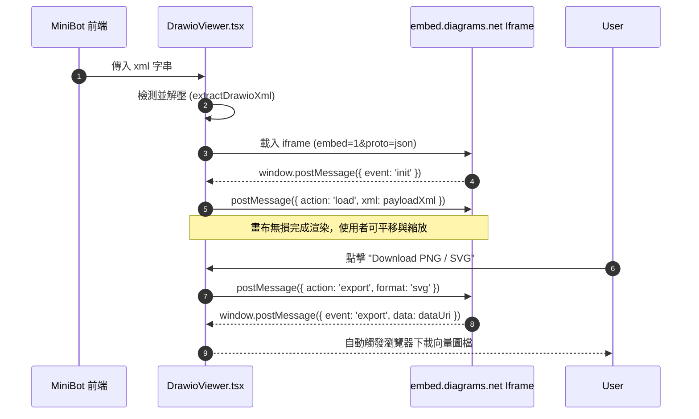

# Chapter 20: Visual Diagram Generation, Editorial SVG Default & Draw.io Architecture

## 一、概述與架構定位 (Overview & Architectural Positioning)

在企業級系統設計、雲原生架構規劃與複雜資料管道的討論中，文字與純 Markdown 表格無法完整呈現拓撲關係、服務分層（Tiers）、時序互動（Sequences）與正交連線（Orthogonal Connectors）。

MiniBot 打造了業界面向企業級架構師的 **三重視覺圖表渲染引擎（Triple Visual Diagram Engine）**，並確立了 **Editorial SVG 優先作為主預設架構（Zero-Sandbox Native Vector）**、**Draw.io 作為互動式可編輯架構（Interactive & Editable）** 的分層核心設計規範：

```
                                  ┌───────────────────────────────────────────────┐
                                  │      User Prompt / Architecture Request       │
                                  └──────────────────────┬────────────────────────┘
                                                         │
                                                         ▼
                                  ┌───────────────────────────────────────────────┐
                                  │       ReAct Loop & Prompt Protocol Core       │
                                  │  (Editorial SVG Default > Draw.io > Mermaid)  │
                                  └──────────────────────┬────────────────────────┘
                                                         │
                     ┌───────────────────────────────────┼───────────────────────────────────┐
                     ▼                                   ▼                                   ▼
      ┌─────────────────────────────┐     ┌─────────────────────────────┐     ┌─────────────────────────────┐
      │   1. Editorial SVG 向量圖   │     │    2. Draw.io 互動架構圖    │     │    3. Mermaid 流程/時序圖   │
      │    (Default & Recommended)  │     │   (Interactive & Editable)  │     │     (Code-Based Charts)     │
      ├─────────────────────────────┤     ├─────────────────────────────┤     ├─────────────────────────────┤
      │ • 原生 `<svg>` 渲染 DOM      │     │ • `<mxfile>` / `<diagram>`  │     │ • `flowchart`, `sequence`   │
      │ • 零 iframe 隔離、無跨域限制 │     │ • 雙向 postMessage 橋接     │     │ • 5 級色調主題 (Sky/Midnight)│
      │ • 100% 離線純向量 SVG 導出  │     │ • 離線/靜態 SVG 雙模轉換    │     │ • 節點字距行距自適應排版     │
      │ • 4 大主題即時變色 (Dark/..│     │ • 直連 diagrams.net 編輯    │     │ • 4:3 / 全景彈窗視角切換    │
      │ • 正交管線與動態高防重疊    │     │ • 支援存為 `.drawio` 原檔   │     │ • 防溢出與括號語法自動容錯  │
      └─────────────────────────────┘     └─────────────────────────────┘     └─────────────────────────────┘
```

---

## 二、Editorial SVG 預設架構設計 (Editorial SVG Primary Protocol)

### 1. 為什麼選擇 Editorial SVG 作為系統主要預設？
1. **零 Sandbox 隔離、100% 匯出可靠性**：
   - Draw.io 在瀏覽器嵌入官方 `embed.diagrams.net` 時，受限於第三方 iframe 的跨域沙盒（Cross-Origin Sandbox），無法直接透過父頁面 DOM 提取向量圖節點；若網路環境受限或 API 阻擋 `postMessage({ action: 'export' })`，導出 SVG 就會失敗。
   - **Editorial SVG 直接渲染於主頁面 DOM**（`SvgDiagramViewer.tsx`），不依賴任何外部伺服器或 iframe，可隨時在客戶端透過 `new XMLSerializer()` 導出 100% 純向量 SVG，無任何跨域或網路延遲風險。
2. **極致渲染效能與離線自主**：
   - 完全離線運行，在無外網內網封閉環境（Air-gapped Environments）中瞬間渲染完成，且原生支持滑鼠滾輪自由縮放（40% ~ 400%）、平移拖曳與 4 大主題即時變色。
3. **HTML 匯出原生保真**：
   - 匯出為 Standalone HTML 報告時，SVG 原始碼直接內嵌於 HTML 文件，無需動態下載外部 viewer JS 腳本即可在任何電腦、手機或紙本列印中以高解析度向量呈現。

### 2. Editorial SVG 提示詞架構與 15 大幾何不變量 (Editorial SVG Prompt Architecture & 15 Design Invariants)

在 `minibot.config.json` 與 `src/config/schema.ts` 中，系統定義了嚴謹的 `svgPrompt` 契約，規範大語言模型在生成原生向量圖表時必須遵守的幾何佈局數學規則與防碰撞不變量（Geometry Invariants）。

#### 📐 15 大核心幾何與排版不變量矩陣

```
┌─────────────────────────────────────────────────────────────────────────────────────────┐
│                           EDITORIAL SVG GEOMETRY INVARIANTS                             │
├──────────────────────────┬──────────────────────────┬───────────────────────────────────┤
│ 1. Clean Light Palette   │ 2. Fan-out Attach Points │ 3. Corridor Routing               │
│ • White/Soft Slate Canvas│ • Uniform attach_x(k)    │ • Never cut through cards         │
│ • Slate Ink / Bold Accent│ • >= 28px~48px clearance │ • M -> V -> H -> V -> H corridors │
├──────────────────────────┼──────────────────────────┼───────────────────────────────────┤
│ 4. No Hairpins / Stubs   │ 5. Text Length Budget    │ 6. Card Height Floor              │
│ • >= 44px parent-child   │ • <= 52 chars per line   │ • height >= lowest_y - card_y+18px│
│ • Direct straight drop   │ • Forced <tspan dy="16"> │ • Bridge cards >= 80px~86px       │
├──────────────────────────┼──────────────────────────┼───────────────────────────────────┤
│ 7. Inline Key-Value Flow │ 8. Strict XML Entities   │ 9. Inter-Zone Breathing Room      │
│ • Single <text> element  │ • UTF-8 •, →, · only     │ • Gap >= 48px~64px between zones  │
│ • Avoid split X guessing │ • Forbid HTML &bull;&rarr│ • Clear 10px line stroke badge    │
├──────────────────────────┼──────────────────────────┼───────────────────────────────────┤
│ 10. Container Padding    │ 11. Card Height Rhythm   │ 12. Strict Text Hierarchy         │
│ • Inner start y+48px     │ • 1-line: >= 56px        │ • Tag -> Title -> Sub -> Desc     │
│ • >= 20px edge margin    │ • 2-line: >= 76px        │ • Gap >= fontSize + 6px           │
│ • Grid gap >= 16px       │ • 3-line: >= 92px        │ • Zero dual-anchor collision      │
├──────────────────────────┼──────────────────────────┼───────────────────────────────────┤
│ 13. Multi-Column Slots   │ 14. Connector Stride     │ 15. XML & Canvas Integrity        │
│ • Non-overlapping columns│ • Straight run >= 16px   │ • Balanced <g> stack              │
│ • x_col = x0 + i*(w+gap) │ • Opaque badge background│ • ViewBox height padding +60~80px │
└──────────────────────────┴──────────────────────────┴───────────────────────────────────┘
```

#### 規則細則與工程原理解析 (Deep-Dive Rules Rationale)

1. **色彩系統與設計語彙 (Palette & Theming)**:
   - **Canvas 畫布**：純白 `#ffffff` 或淺石板灰 `#f8fafc`，外框使用俐落的 `stroke="#e2e8f0"`。
   - **品牌主強調色 (Primary Accents)**：海藍 `#2563eb`、翡翠綠 `#059669`、皇家紫 `#7c3aed`、暖琥珀 `#d97706`、寶石紅 `#e11d48`。
   - **中性容器卡片**：背景卡片 `#f8fafc`、選取強調 `#f1f5f9`、次級卡片 `#ffffff`、格線 `#e2e8f0`。
   - **文字分層階級**：標題 `#0f172a`、內文 `#334155`、副標/標籤 `#64748b`、柔和微章 `#94a3b8`。

2. **扇出多連接線分流錨點 (Fan-out Multi-Connector Attach Points)**:
   - **痛點**：多條連接線（例如 3 條自上方柱狀區域匯聚向下流入中央調度器 Dispatcher 卡片）若全部擠入卡片正中央單一點，會造成箭頭（Arrowheads）重疊穿透、線條交錯窒息。
   - **數學約束**：當 $N$ 條連線匯聚到同一個卡片上邊界時，必須依序均勻分配 X 座標：
     $$\text{attach\_x}(k) = \text{card\_x} + \frac{\text{card\_width} \times k}{N + 1} \quad (k = 1, 2, \dots, N)$$
     且每個錨點間隔維持 $\ge 28\text{px} \sim 48\text{px}$ 的安全淨空。

3. **嚴格障礙物避讓與廊道路由 (Strict Obstacle Avoidance & Corridor Routing)**:
   - **痛點**：LLM 生成直連座標時，連線常會直接穿透並切斷中間的相鄰卡片（例如從左側內層元件直接穿透右側元件橫跨到另一區塊）。
   - **幾何約束**：連接線**嚴禁**穿過任何中介組件卡片或文字。跨區域非相鄰連線必須：
     - 走外圍專屬正交淨空廊道（`M -> V -> H -> V -> H`），外圍邊距與卡片外框保持 $\ge 16\text{px}$ 淨空；或者
     - 直接從最靠外側、面向目的地的邊界元件拉出連線。連線文字徽章（Label Badge）必須座落於柱狀區間的開放廊道，嚴禁騎在任何卡片邊界上。

4. **禁止髮夾彎 U 型轉折與懸空斷線 (No Hairpin U-Turns, Orphan Stubs, or Truncated Connectors)**:
   - **痛點**：在垂直空間過度狹窄（$< 32\text{px}$）時，模型常畫出繞回自身來源卡片的緊湊髮夾彎，或是產生半截沒連到目標的孤立端點。
   - **幾何約束**：當父卡片向下連接同欄位首個子卡片時，必須保持垂直軸線直接對齊垂直向下直線（`M mid_x parent_bottom V child_top`）。父卡片底部與子卡片頂部的垂直間距**必須** $\ge 44\text{px} \sim 56\text{px}$（絕對禁止 $< 32\text{px}$）。所有連接線都必須具備明確的起點與終點卡片。

5. **文字行長預算與強制雙行換行 (Text Line Length Budget & Forced Two-Line Wrapping)**:
   - **痛點**：SVG 原生 `<text>` 標籤**不支援自動換行**！在標準卡片寬度（380px ~ 440px）下，若技術說明文字超過 52 個字元，字串將會直接衝出卡片右側外框。
   - **幾何約束**：單行文字嚴格限制 $\le 52$ 字元（含空白）。若超過長度，必須顯式拆分為雙行 `<tspan>` 結構：
     ```xml
     <text x="card_x + 16" y="card_y + 36" fill="#334155" font-size="12">
       <tspan x="card_x + 16" dy="0">First half of long text statement...</tspan>
       <tspan x="card_x + 16" dy="16">Second half of text wrapped cleanly</tspan>
     </text>
     ```
     文字右緣距卡片右邊框至少預留 20px 安全邊距。

6. **卡片高度下限由最低文字基準線決定 (Card Height Floor Invariant)**:
   - **痛點**：模型隨機寫死卡片固定高度（例如 `height="60"`），但內容塞了徽章、標題與兩行說明，導致卡片底線直接橫切過最後一行文字。
   - **幾何約束**：卡片矩形高度必須由其包含的最低文字 Y 座標反向計算：
     $$\text{card\_height} \ge (\text{lowest\_text\_y} - \text{card\_y}) + 18\text{px}$$
     對於包含微章 + 標題 + 副標題的橋接卡片（Root / Bridge Cards），其高度底限為 $80\text{px} \sim 86\text{px}$（絕不可 $\le 65\text{px}$）。

7. **鍵值對內聯單一 Text 標籤 (Inline Key-Value & Bullet Lists)**:
   - **痛點**：模型將 `• Hardware Footprint:` 與 `Runs on existing silicon` 拆成兩個獨立 `<text>` 標籤並手動猜測 X 座標，導致在不同作業系統字型渲染時，文字發生重疊穿透或過大斷層。
   - **排版約束**：一律使用單一 `<text>` 容器，透過內聯 `<tspan>` 賦予粗體樣式：
     ```xml
     <text x="40" y="80" font-size="12" fill="#334155">
       <tspan font-weight="600" fill="#0f172a">• Hardware Footprint:</tspan> Runs on existing silicon without cryogenics
     </text>
     ```
     由瀏覽器排版引擎自動計算文字字寬與推進距離，徹底杜絕單字撞車。

8. **嚴格 XML 實體安全與符號轉義 (XML Entity Safety & Literal Symbols)**:
   - **痛點**：模型習慣輸出 HTML 具名實體（如 `&bull;`, `&rarr;`, `&nbsp;`, `&mdash;`），但在純 XML / SVG 解析器中會直接觸發致命的 `XML Parsing Error: undefined entity`，導致整個圖表反白崩潰。
   - **規範約束**：箭頭一律使用 UTF-8 原生符號 `→`, `←`, `↔` 或十進位數字實體 `&#8594;`；圓點一律使用 UTF-8 `•` 或 `&#8226;`；標準轉義字元僅限 5 大 XML 實體：`&amp;`, `&lt;`, `&gt;`, `&quot;`, `&apos;`。

9. **跨區域呼吸空間與垂直淨空 (Inter-Zone Breathing Room & Vertical Clearance)**:
   - 主要架構區域（Zone / Pillar）堆疊時，相鄰區域邊框間距必須 $\ge 48\text{px} \sim 64\text{px}$（不可 $\le 30\text{px}$）。
   - 跨區域流向箭頭長度至少 40px，讓箭頭標籤徽章（Badge height = 20px）在徽章上方與下方各自保有至少 10px 的可見線條行程，文字徽章絕不觸碰目標區塊的上邊框。

10. **容器內襯邊距與網格間隔 (Container Inset Padding & Card Grid Spacing)**:
    - 柱狀或容器（Container）內部的子組件卡片，起始位置必須為 `y_container + 48px`（24px 區域標題高度 + 24px 緩衝區）。
    - 容器側邊預留至少 20px 水平內襯。子組件卡片彼此之間保持 $\ge 16\text{px}$ 的網格間距。

11. **卡片垂直節奏與最低高度 (Card Height & Vertical Rhythm)**:
    - 單行標題卡片：$\text{min-height} \ge 56\text{px}$。
    - 標題 + 副標題卡片：$\text{min-height} \ge 76\text{px}$。
    - 標題 + 雙行副標 / 規格卡片：$\text{min-height} \ge 92\text{px}$。
    - 卡片內部四邊 padding 保持 $\ge 14\text{px}$。

12. **嚴格文字階層堆疊 (Strict Text Hierarchy & Collision-Free Stacking)**:
    - 垂直堆疊座標公式：Tag Badge $y = \text{top} + 20$ $\rightarrow$ Title $y = \text{tag\_y} + 24$ $\rightarrow$ Subtitle $y = \text{title\_bottom} + 18$ $\rightarrow$ Description $y = \text{subtitle\_bottom} + 16$。
    - 每行文字間距維持 $\ge \text{fontSize} + 6\text{px}$。禁止外層容器標題與內層子階段標題共享相同或重疊的 X 軸與 Y 軸範圍。

13. **多欄路徑與階段橫向槽位 (Horizontal Multi-Column Banners & Roadmaps)**:
    - 嚴格均分可用寬度槽位：$x_{\text{col}}(i) = x_0 + i \times (\text{col\_width} + \text{col\_gap})$。
    - 欄位文字長度絕不可超過 $\text{col\_width} - 16\text{px}$。

14. **中央橋接卡片與連接線步幅 (Central Bridge Cards & Connector Stride)**:
    - 每條引出線自卡片射出時，必須先筆直前進至少 16px 的步幅（Stride）才可進行 90 度轉折或懸掛標籤。
    - 連線標籤徽章必須帶有不透明遮罩背景 `<rect fill="#ffffff" rx="3"/>`，防止連接線直接穿透劃破文字。

15. **XML 標籤平衡與畫布畫框完整性 (XML & Tag Integrity)**:
    - 每個 `<g>` 群組必須有嚴格對應的閉合 `</g>`。
    - 畫布 `viewBox` 底部必須額外預留 $+60\text{px} \sim 80\text{px}$ 的縱向緩衝空間，防止最底層的註腳與告警框被截斷。

---

### 3. 前端容錯與自修復管線 (`MarkdownRenderer.tsx` & `SvgDiagramViewer.tsx`)

為了保障大模型即便在流式傳輸被中斷、或產生非標準 HTML 實體時仍能 100% 成功渲染，前端實現了五重自動防護與修復引擎：

```
                ┌─────────────────────────────────────────────────────────┐
                │          Raw LLM Stream / Incomplete Response           │
                └────────────────────────────┬────────────────────────────┘
                                             │
                                             ▼
                ┌─────────────────────────────────────────────────────────┐
                │ 1. Truncated Stream Detection & Dynamic Tag Balancing   │
                │    • Strips incomplete trailing attributes (<text fo... │
                │    • Automatically closes missing </g> containers       │
                │    • Appends closing </svg> tag                         │
                └────────────────────────────┬────────────────────────────┘
                                             │
                                             ▼
                ┌─────────────────────────────────────────────────────────┐
                │ 2. HTML-Only Entity Normalization (Unicode Replacement) │
                │    • &bull; -> • | &rarr; -> → | &larr; -> ←            │
                │    • &mdash; -> — | &nbsp; -> [Space] | &hellip; -> …   │
                └────────────────────────────┬────────────────────────────┘
                                             │
                                             ▼
                ┌─────────────────────────────────────────────────────────┐
                │ 3. Bare Ampersand Auto-Escaping                         │
                │    • Converts raw '&' to '&amp;'                        │
                │    • Safely preserves valid numeric/named XML entities  │
                └────────────────────────────┬────────────────────────────┘
                                             │
                                             ▼
                ┌─────────────────────────────────────────────────────────┐
                │ 4. DOM-Tree Semantic Recoloring (4 Realtime Themes)     │
                │    • 'original' / 'clean-light' / 'dark-slate' / 'warm' │
                │    • Intelligently recolors rect fills, strokes & text  │
                │    • Eliminates text-on-background invisibility bugs   │
                └────────────────────────────┬────────────────────────────┘
                                             │
                                             ▼
                ┌─────────────────────────────────────────────────────────┐
                │ 5. Native DOM Rendering & Pure Vector Export            │
                │    • Zero-iframe direct injection                       │
                │    • 100% Client-side XMLSerializer Blob Download       │
                │    • Smooth Zoom (40%~400%) & Pan Lightbox              │
                └─────────────────────────────────────────────────────────┘
```

1. **截斷串流自動閉合 (Stream Truncation Auto-Closing)**：若模型因輸出 token 達到上限而中斷在 `<text font-size="...`，演算法會先清除尾端不完整標籤，動態計算當前未閉合的 `<g>` 數量並自動補齊 `</g>`，最後追加 `</svg>`，使中斷圖表仍能正常顯示可見部分而非整幅空白報錯。
2. **HTML 實體字元標準化 (Entity Normalization)**：正則即時攔截並置換 `&bull;` $\rightarrow$ `•`、`&rarr;` $\rightarrow$ `→`、`&larr;` $\rightarrow$ `←`、`&mdash;` $\rightarrow$ `—`、`&nbsp;` $\rightarrow$ 空白，防止瀏覽器 XMLSerializer 報錯。
3. **裸 `&` 符號智慧轉義 (Bare Ampersand Escaping)**：利用負向先行斷言 `/&(?!(?:amp|lt|gt|quot|apos|#\d+|#[xX][0-9a-fA-F]+);)/g`，自動將工程名詞中的 `&`（例如 `QKD & PQC`）轉義為 `&amp;`。
4. **DOM 語意化即時主題切換 (4-Theme Recoloring)**：`SvgDiagramViewer.tsx` 解析 DOM 樹，針對大底色、容器背景、卡片頂部色條與文字進行語意著色，避免傳統全域字串替換造成的文字與背景同色問題。
5. **純向量原生提取 (Native Vector Export)**：點擊「Download SVG」時，前端直接對渲染後的 SVG 節點調用 `new XMLSerializer().serializeToString(svgElement)`，生成純淨的 UTF-8 SVG 檔案供使用者下載。

---

## 三、Draw.io 互動架構設計 (Draw.io Interactive Protocol)

### 1. 為什麼優先選擇 Draw.io 而非 SVG 或 Mermaid？
1. **完全可編輯性（Round-Trip Editability）**：傳統 SVG 僅為靜態圖元，二次編輯極其困難；Mermaid 語法簡潔但在佈局複雜架構（如跨雲、跨網段、多層嵌套 Subnets）時排版容易失控。Draw.io XML (`<mxfile>`) 具備完整的節點座標、圖形樣式、分組與連線端點，使用者可隨時微調。
2. **標準化企業生態**：Draw.io / diagrams.net 為全球最廣泛使用的開源圖表工具，產出的 XML 可直接存為 `.drawio`，無縫導入 Confluence、VSCode Draw.io 擴展、Desktop 應用程式或 GitHub。
3. **高保真度渲染**：透過官方 `embed.diagrams.net` 與 `viewer-static.min.js`，在瀏覽器中能呈現像素級細緻的正交曲線、投影陰影與高質感色彩分層。

### 2. Prompt 契約規範 (`src/config/schema.ts`)
系統在 `PromptsConfigSchema` 的 `skillsPrompt` 與 `svgPrompt` 中強制注入模型生成規範：
- **容器語法**：一律輸出標準 Draw.io XML，置於 ````drawio` 或 ````xml` 代碼區塊內，包含完整的 `<mxfile host="Electron" ...><diagram>...<mxGraphModel>...</mxGraphModel></diagram></mxfile>`。
- **XML 屬性強制轉義**：所有節點標籤（如 `value="..."`）中的 HTML 標記與特殊字元必須嚴格 XML 轉義（例如 `value="&lt;b&gt;API Gateway&lt;/b&gt;"`），嚴禁直接在 XML 屬性字串中寫入原始未轉義的 `<` 或 `>`，防止 XML 解析器致命中斷。
- **正交與階層樣式**：連接線優先採用正交轉折樣式（`edgeStyle=orthogonalEdgeStyle;rounded=1`），並為不同的架構階層（Presentation Tier, Logic Tier, Persistence Tier）指派高對比度且清爽的填充色與邊框色。

---

## 四、前端 DrawioViewer 組件架構 (`DrawioViewer.tsx`)

位於 [frontend/src/components/DrawioViewer.tsx](file:///c:/ai/loop-engg/frontend/src/components/DrawioViewer.tsx)，其具備強大的互動視圖與控制管線：

### 1. 雙向 postMessage 通訊狀態機
與 `embed.diagrams.net` 官方 iframe 建立乾淨的生命週期握手：


```mermaid
sequenceDiagram
    autonumber
    participant App as MiniBot 前端
    participant Viewer as DrawioViewer.tsx
    participant Iframe as embed.diagrams.net Iframe

    App->>Viewer: 傳入 xml 字串
    Viewer->>Viewer: 檢測並解壓 (extractDrawioXml)
    Viewer->>Iframe: 載入 iframe (embed=1&proto=json)
    Iframe-->>Viewer: window.postMessage({ event: 'init' })
    Viewer->>Iframe: postMessage({ action: 'load', xml: payloadXml })
    Note over Viewer,Iframe: 畫布無損完成渲染，使用者可平移與縮放
    User->>Viewer: 點擊 "Download PNG / SVG"
    Viewer->>Iframe: postMessage({ action: 'export', format: 'svg' })
    Iframe-->>Viewer: window.postMessage({ event: 'export', data: dataUri })
    Viewer-->>User: 自動觸發瀏覽器下載向量圖檔
```

### 2. 壓縮封裝自動解開 (`drawioHelper.ts`)
模型或外部匯入的 Draw.io 圖表有時會採用 Deflate 壓縮字串包裹在 `<diagram>...base64...</diagram>` 中。`drawioHelper.ts` 整合現代瀏覽器原生 `DecompressionStream('deflate-raw')`，無需額外引入龐大的 pako.js 或 zlib，在客戶端毫秒級還原純 XML。

### 3. 多重下載與回退機制 (Export Fallback Pipeline)
- **原生 postMessage 導出**：請求 iframe 返回高解析度 SVG / PNG Data URI。
- **同源 DOM 提取**：若具備同源權限，直接克隆 iframe 內部的 `<svg>` 節點轉為 Blob 下載。
- **磁碟 `.drawio` 保存**：隨時一鍵保存為原生 XML `.drawio` 檔案。
- **直連 Web 編輯器**：一鍵開啟 `https://app.diagrams.net/#R{encodedXml}`，跳轉至 diagrams.net 全功能線上繪圖工作台。

---

## 五、Editorial SVG 向量圖架構 (`SvgDiagramViewer.tsx`)

若使用者明確指定需要輕量、純 DOM 原生嵌入的向量圖，系統提供 **Editorial SVG** 渲染管線：
1. **純 DOM 原生隔離**：直接以原生 SVG 標籤插入網頁，零 iframe 延遲。
2. **四重主題即時動態著色（DOM-Based Recoloring）**：
   - `original`：保留模型原始配色。
   - `clean-light`：現代高雅白晝色系（#2563eb / #0f172a）。
   - `dark-slate`：沉浸式暗黑黑客風格（#0f172a / #38bdf8）。
   - `warm-paper`：典雅紙本色調（#fafaf9 / #b45309）。
   - *演算法特性*：透過 DOM 樹節點特徵精準過濾 `<rect>` 背景與 `<text>` 字型顏色，杜絕傳統正則字串替換造成的「文字與背景同色看不見」之渲染瑕疵。
3. **無損縮放與拖曳**：支持滑鼠滾輪縮放（40% ~ 400%）、雙擊重置、全螢幕燈箱模式（Pop-up 85vw x 82vh）。

---

## 六、Mermaid 渲染與安全守衛 (`MermaidDiagram.tsx` & `mermaidGuardrail.ts`)

針對傳統代碼圖表（Flowcharts, Sequence Diagrams, ER Models, Class Diagrams）：
1. **語法自動容錯修復（Auto-Sanitization）**：
   - 自動修復子圖中括號巢狀語法（如 `subgraph sub1 [API (v2)]` 轉為標準雙引號）。
   - 自動包裹未加引號的特殊字元標籤。
2. **智慧節點折行（Smart Text Wrap）**：
   - 解決中文、全形標點符號與英數長字串在 Mermaid SVG 中的跑版溢出問題，依語意標點自動切換 `<br/>` 折行。
3. **自適應外框與視野展開**：
   - 支援 4:3 比例標準畫框、80% 視窗全景展開、行距動態調節（↕1.0 ~ ↕2.8）。

---

## 七、底欄 Dock Bar 圖表快速切換器 (`App.tsx`)

在主輸入框底欄的 **Diagram Mode Selector** 中，使用者可一鍵切換不同圖表生成模式：
- **🎨 Editorial SVG (Default & Recommended)**：遵循 `diagram-design` 規範輸出高品質原生 SVG 向量圖，支援 100% 離線匯出與即時變色。
- **📐 Draw.io Diagram**：發送強制 prompt 引導模型以 `<mxfile>` 輸出可於 diagrams.net 二次編輯的架構圖。
- **🛠️ Auto-Fix SVG**：針對上一輪發生的圖例重疊（Legend Overlap）進行座標自動修正重繪。
- **📊 Mermaid Flowchart / Sequence / Topology / Mindmap**：傳統代碼流程圖。
- **🤖 AI Auto**：由大模型自律評估是否需要輔以視覺圖表。
- **🚫 No Diagram (Text Only)**：強制純文本與表格回答。

---

## 八、總結：多模態視覺工程矩陣

| 特性比較 | Editorial SVG (Default) | Draw.io 架構圖 | Mermaid 圖表 |
| :--- | :--- | :--- | :--- |
| **預設優先級** | ⭐ **第一優先 (Default)** | 第二優先 (可選用) | 按需使用 |
| **檔案/載體格式** | `<svg>` 向量標記 | `<mxfile>` / `.drawio` XML | 文本 DSL 語法 |
| **匯出與下載可靠度** | **100% 離線原生無損** (DOM 提取) | 需經 postMessage 或跳轉 editor | **100% 離線無損** (mermaid.render) |
| **二次可編輯性** | 低 (需手動修 SVG 代碼) | **極高** (可直接拖曳元件/改線) | 中等 (需編輯文本 DSL) |
| **複雜佈局適應力** | 高 (手動計算 viewBox、正交管線) | **極高** (自由座標、正交路由) | 中等 (受限於 dagre 自動排版) |
| **Web 預覽方式** | DOM 原生嵌入 (零 iframe) | diagrams.net Iframe / Viewer | mermaid.js 渲染 SVG |
| **HTML 匯出支援** | **完全支援 (原樣 SVG 向量圖)** | **完全支援 (轉 SVG 向量圖 / 預覽卡片)** | **完全支援 (SVG 向量圖)** |
